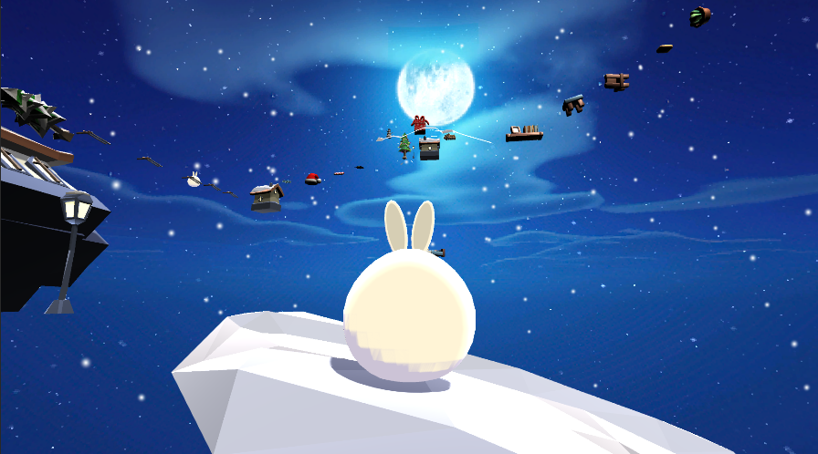

<h1>🐰 눈토끼의 Only UP</h1>

   
### ❄ _Unity 2기 변정민 개인 과제입니다._ ❄

---
## ❓ 이 게임은요
- 3D 항아리류 게임입니다.
- [Only Up!](https://only-up.softonic.kr/)의 모작입니다.

---
## 🎮 게임 플레이 방법
1. 캐릭터 이동은 키보드 W, A, S, D키로 가능합니다.
2. 키보드 Space키를 눌러 점프할 수 있습니다.
3. 빨간 선물 상자에 닿으면 체크포인트가 설정됩니다.
4. 설정된 체크포인트는 맵 밖으로 떨어질 경우 발동됩니다.
5. 맵에 숨겨진 침대에서 점프하면 아주 높이 점프할 수 있습니다!
6. 일부 발판에는 함정이 존재합니다 . . .

---
## ⭐ 새로운 기술 시도
1. PlayerController 리팩토링
   
   1-1. 기존 Input System 방식의 PlayerController에 커맨드 패턴을 적용하여 리팩토링

2. Addressable 적용

   2-1. IntroScene과 GameScene에 Addressable을 적용하여 Hierarchy에 있는 오브젝트 최소화

3. 스크립트로 버튼에 이벤트 추가

   3-1. IntroScene 시작 버튼의 OnClick에 오브젝트를 드래그하지 않고 AddListener, delegate를 이용해 스크립트로 처리

---
## 📆 개발 기간
- 2023.12.26 ~ 2023.12.29

---
### 🔗 리소스
1. [스카이박스](https://assetstore.unity.com/packages/2d/textures-materials/sky/fantasy-skybox-free-18353)
2. [플레이어](https://assetstore.unity.com/packages/3d/characters/creatures/kawaii-slimes-221172)
3. [베이스 지형](https://assetstore.unity.com/packages/3d/environments/landscapes/flatpoly-winter-village-51544#content)
4. [장애물 1](https://assetstore.unity.com/packages/3d/props/free-christmas-assets-low-poly-13102)
5. [장애물 2](https://kaylousberg.itch.io/furniture-bits)
6. [장애물 3](https://assetstore.unity.com/packages/3d/props/stylize-house-props-low-poly-266235)
7. [FX](https://assetstore.unity.com/packages/vfx/particles/hyper-casual-fx-200333)
8. [안내판](https://assetstore.unity.com/packages/3d/props/exterior/us-road-signs-free-164941)
9. [배경음악](https://alkakrab.itch.io/free-25-fantasy-rpg-game-tracks-no-copyright-vol-2)
